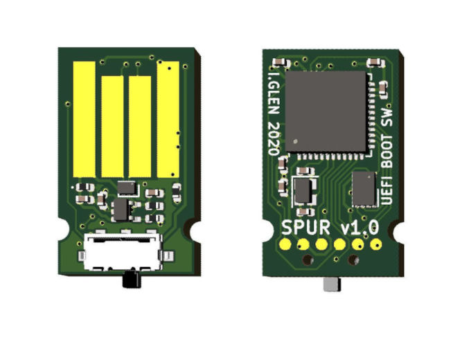

# spur-hardware

A physical UEFI boot switch -- PCB design files.

## Theory of Operation

Spur appears as a virtual USB mass storage device and acts as a first-stage UEFI bootloader. This bootloader loads a specific boot entry in the system UEFI table depending on the position of a physical switch on the device.

A 1MB SPI NOR flash chip contains the FAT32 filesystem on which the UEFI bootloader lives. An STM32F4 microcontroller provides read/write access to the flash over USB. In addition, it presents a virtual file which is read by the bootloader to determine the state of the physical switch.

## License

The MIT License

Copyright 2020 Ian Glen

Permission is hereby granted, free of charge, to any person obtaining a copy of this software and associated documentation files (the "Software"), to deal in the Software without restriction, including without limitation the rights to use, copy, modify, merge, publish, distribute, sublicense, and/or sell copies of the Software, and to permit persons to whom the Software is furnished to do so, subject to the following conditions:

The above copyright notice and this permission notice shall be included in all copies or substantial portions of the Software.

THE SOFTWARE IS PROVIDED "AS IS", WITHOUT WARRANTY OF ANY KIND, EXPRESS OR IMPLIED, INCLUDING BUT NOT LIMITED TO THE WARRANTIES OF MERCHANTABILITY, FITNESS FOR A PARTICULAR PURPOSE AND NONINFRINGEMENT. IN NO EVENT SHALL THE AUTHORS OR COPYRIGHT HOLDERS BE LIABLE FOR ANY CLAIM, DAMAGES OR OTHER LIABILITY, WHETHER IN AN ACTION OF CONTRACT, TORT OR OTHERWISE, ARISING FROM, OUT OF OR IN CONNECTION WITH THE SOFTWARE OR THE USE OR OTHER DEALINGS IN THE SOFTWARE.
